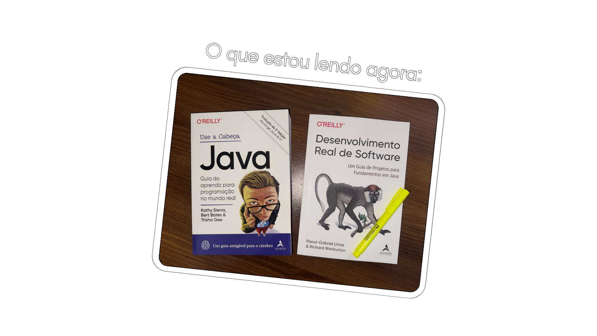

### 👋🏻 Sobre mim
- Engenheiro de Software formado pelo [Inatel](https://inatel.br)  
- Pós-graduando em [DevOps & Arquitetura Cloud na FIAP](https://postech.fiap.com.br/curso/devops-e-arquitetura-cloud)
- Desenvolvedor back-end em **Java** ☕️

  

Ultimamente, estou estudando para aprimorar minhas habilidades em **Spring** 🍃. Dê uma olhada nos meus projetos abaixo 👇🏻
